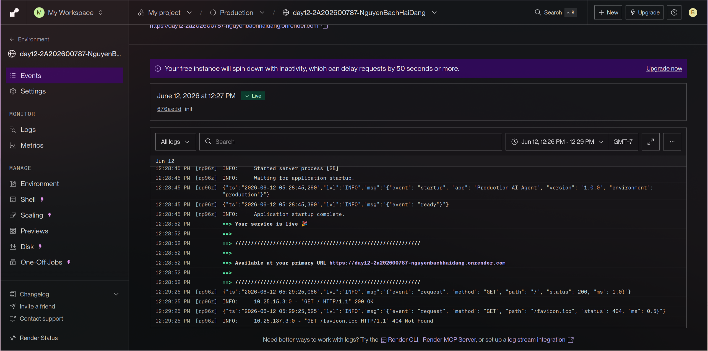
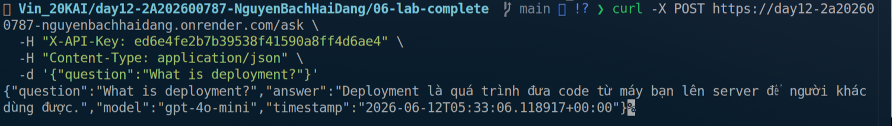

# Deployment Information

> **Student:** Nguyen Bach Hai Dang · **ID:** 2A202600787

## Public URL

```
https://day12-2a202600787-nguyenbachhaidang.onrender.com
```

## Platform

**Render** — Web Service, Docker runtime, region Singapore.
Root directory: `06-lab-complete/`

## Test Commands

### 1. Health Check (no auth)
```bash
curl https://day12-2a202600787-nguyenbachhaidang.onrender.com/health
```

### 2. Readiness probe
```bash
curl https://day12-2a202600787-nguyenbachhaidang.onrender.com/ready
```

### 3. Auth required (no key → 401)
```bash
curl -i -X POST https://day12-2a202600787-nguyenbachhaidang.onrender.com/ask \
  -H "Content-Type: application/json" \
  -d '{"question":"Hello"}'
# Expected: HTTP/1.1 401 Unauthorized
```

### 4. API test (with key → 200)
```bash
curl -X POST https://day12-2a202600787-nguyenbachhaidang.onrender.com/ask \
  -H "X-API-Key: <YOUR_AGENT_API_KEY>" \
  -H "Content-Type: application/json" \
  -d '{"question":"What is love?"}'
# Expected 200: {"question":"...","answer":"...","model":"gpt-4o-mini","timestamp":"..."}
```

### 5. Rate limiting (eventually → 429)
```bash
for i in $(seq 1 25); do
  curl -s -o /dev/null -w "%{http_code}\n" \
    -X POST https://day12-2a202600787-nguyenbachhaidang.onrender.com/ask \
    -H "X-API-Key: <YOUR_AGENT_API_KEY>" \
    -H "Content-Type: application/json" \
    -d '{"question":"test"}'
done
```

## Environment Variables Set on Render

| Key | Value | Notes |
|-----|-------|-------|
| `ENVIRONMENT` | `production` | Disables /docs, enforces secret validation |
| `APP_VERSION` | `1.0.0` | |
| `AGENT_API_KEY` | *(generated / secret)* | Required — used in `X-API-Key` header |
| `JWT_SECRET` | *(generated / secret)* | Required in production |
| `RATE_LIMIT_PER_MINUTE` | `10` | Per user |
| `MONTHLY_BUDGET_USD` | `10.0` | Cost guard — per user, per calendar month |
| `REDIS_URL` | *(from `agent-redis`)* | Shared state for stateless scaling; falls back to in-memory if absent |
| `OPENAI_API_KEY` | *(empty)* | Empty → uses mock LLM (no real cost) |
| `PORT` | `8000` | Match the port the container listens on |


## Screenshots

- 
- 
- 
